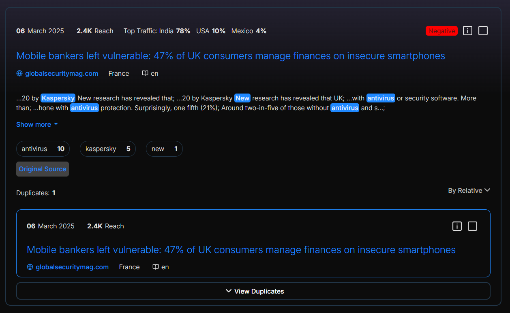

# Тестовое задание от Касперский
страница доступно по ссылку 
https://k1ng-ali.github.io/ksp-test

### Preview


## Структура проекта

[project]()\
├── [src](src/)\
│ ├── [Utils](src/Utils) - утилиты\  
│ └── [Components](src/Сomponents/) - компоненты\
│  . . . . . . └── [PostCard](src/Сomponents/PostCard/) - компонент новость\
│ . . . . . . . . . └── [Types](src/Сomponents/PostCard/Types) - интерфейсы


## Компоненты
### [PostCard.tsx](src/Сomponents/PostCard/PostCard.tsx)
```ts
    interface Props {
        data: IData_SnippetNews
    }
    
    const PostCard: React.FC<Props> = ({data}) => {
        return (
            <div className={`PostCard`}>
        <PostInfo data={data}/> 
        <p className={'title'}>{data.TI}</p>
            <AuthorInfo data={data}/>
        <Content data={data}/>
        <div className={'kw-container'}>
            {data.KW.map((item, i) => (
                    <div className={'kw'} key={i}>
                <p className={`kw-item`}>{item.value}</p>
            <p className={`count kw-item`}>{item.count}</p>
        </div>
    ))}
        </div>
        <a href={data.URL}>
        <div className={`source`}>Original Source</div>
        </a>
        <div className={`duplicate-info`}>
            <p className={`duplicates`}>Duplicates: <p className={`count`}> 1 </p></p>
            <button className={`btn sort-btn`}>By Relative {<FaChevronDown />}</button>
        </div>
        <DuplicatePost  data={data}/>
        <button className={`more-duplicates`}>{<FaChevronDown className={`ico`}/>}View Duplicates</button>
        </div>
        );
        };
    export default PostCard;
```
### [PostInfo.tsx](src/Сomponents/PostCard/PostInfo.tsx)
```ts 
    interface Props {
    data: IData_SnippetNews
}

export const PostInfo: React.FC<Props> = ({data}) => {
    return (
        <div className="post-info">
        <div className={`post-info-left`}>
    <div className={`dp info-item`}><p className="day">{parseDate(data.DP).day}</p> {parseDate(data.DP).month} {parseDate(data.DP).year}</div>
    <div className={`reach info-item`}><p className="count">{formatNumber(data.REACH)}</p>Reach</div>
    <div className={`traffic info-item`}>
    {data.TRAFFIC.length > 0 ?
        (<>Top Traffic: {data.TRAFFIC.map((traffic, index) =>
        (
            <div key={index} className={`traffic-item`}>
        <p>{formatTrafficData(traffic).value}</p>
        <p className="count">{formatTrafficData(traffic).count}</p>
            </div>
    ))}</>
    ): null
    }
    </div>
    </div>
    <div className={`post-info-right info-item`}>
    {data.SENT !== " " ?
        <div className={`sent ${data.SENT === "negative" ? 'negative' : 'positive'}`}>{data.SENT === "negative" ? "Negative" : "Positive"}</div>
    : null}
    <GrStatusInfo className={`status status-ico`}/>
    <GrStatusPlaceholder className={`status-ico`}/>
    </div>
    </div>
);
};

```
### [Content.tsx](src/Сomponents/PostCard/Content.tsx)
```ts
interface Props {
    data: IData_SnippetNews
}

export const Content: React.FC<Props> = ({data}) => {
    const [collapsed, setCollapsed] = React.useState(false);

    const handleToggleCollapse = () => {
        setCollapsed(!collapsed);
    }
    const higlights = extractKeywords(data.HIGHLIGHTS)
    return (
        <div className="content">
            {collapsed ? (
                    <p className="ab">{data.AB}</p>
                ):(
                    <p className="higlights-text"
                dangerouslySetInnerHTML={{ __html: higlights}}/>
)}
    <button onClick={handleToggleCollapse} className={`btn`}>{collapsed ? "Show less" :"Show more"} {collapsed ? <FaCaretUp /> : <FaCaretDown />}</button>
    </div>

);
};
```
### [AuthorInfo.tsx](src/Сomponents/PostCard/AuthorInfo.tsx)
```ts
interface Props {
    data: IData_SnippetNews
}


export const AuthorInfo: React.FC<Props> = ({data}) => {
    const [icoIsloaded, setIcoIsloaded] = React.useState(true);

    const errorloadIco = () => {
        setIcoIsloaded(false);
    }

    return (
        <div className={`author-info`}>
    <a className={`url author-item`} href={data.URL}><LuGlobe className={`ico`}/> <p>{extractDomain(data.URL)}</p></a>
    <div className={`cntr author-item`}> {icoIsloaded ?  : " "} <p>{data.CNTR}</p> </div>
    <div className={`lang author-item`}><LuBookOpen className={`ico`}/><p>{data.LANG}</p></div>
        {data.AU.length > 0 ?
            <div className={`autor author-item`}><RiUser3Line />
        {
            data.AU.map((item, i) => (
                <p key={i}>{item}</p>
            ))
        }
        </div> : null
        }
        </div>
    );
    };
```

### [DuplicatePost.tsx](src/Сomponents/PostCard/DuplicatePost.tsx)
```ts
interface Props {
    data:IData_SnippetNews
}

export const DuplicatePost: React.FC<Props> = ({data}) => {
    const newdata = data
    newdata.TRAFFIC = []
    newdata.SENT = " "
    return (
        <div className={`duplicatePostCard`}>
    <PostInfo data={newdata}/>
    <p className={'title'}>{newdata.TI}</p>
        <AuthorInfo data={newdata}/>
    </div>
)
}
```

## Утилиты
### [Utils.ts](src/Utils/Utils.ts)
### формат даты
```ts   
    export function parseDate(dateString: string): { day: string; month: string; year: string } {
    const date = new Date(dateString);

    const day = date.getDate().toString().padStart(2, '0'); // "06"
    const month = date.toLocaleString('en-US', { month: 'long' }); // "March"
    const year = date.getFullYear().toString(); // "2025"

    return { day, month, year };
}
```
### формат траффик
```ts
export function formatTrafficData(data: { value: string; count: number }) {
    // Словарь с сокращениями стран
    const countryAbbreviations: { [key: string]: string } = {
        "United States of America": "USA",
        "United Kingdom": "UK",
        "Russian Federation": "Russia",
        "People's Republic of China": "China",
        "Republic of Korea": "South Korea",
        "Democratic People's Republic of Korea": "North Korea",
        "United Arab Emirates": "UAE",
    };
    const formattedValue = countryAbbreviations[data.value] || data.value;
    const formattedCount = (data.count * 100).toFixed(0) + "%";

    return {
        value: formattedValue,
        count: formattedCount
    };
}
```
### формат число
```ts
export function formatNumber(value: number): string {
    if (value >= 1_000_000) {
        return (value / 1_000_000).toFixed(1) + "M"; // "M" для миллионов
    } else if (value >= 1_000) {
        return (value / 1_000).toFixed(1) + "K"; // "K" для тысяч
    } else {
        return value.toString(); // Преобразуем число в строку
    }
}
```
### парсинг ключевые слова
```ts
export function extractKeywords(items: string[], contextWords: number = 5): string {
    const result: string[] = [];

    items.forEach(text => {
        const words = text.split(/\s+/);

        words.forEach((word, index) => {
            if (word.startsWith('<kw>') && word.endsWith('</kw>')) {
                const keyword = word.replace(/\|/g, '');
                const start = Math.max(index - contextWords, 0);
                const end = Math.min(index + contextWords + 1, words.length);

                const context = words.slice(start, end).map(w =>
                    w === word
                        ? `<span class="highlight">${keyword}</span>`
                        : w
                ).join(' ');

                result.push(context + ';');
            }
        });
    });

    return result.join(' ');
}
```
### парсинг домен
```ts
export function extractDomain(url: string): string {
    try {
        const parsedUrl = new URL(url);
        const hostnameParts = parsedUrl.hostname.split('.');
        const len = hostnameParts.length;

        if (len >= 2) {
            return `${hostnameParts[len - 2]}.${hostnameParts[len - 1]}`;
        }

        return parsedUrl.hostname;
        // eslint-disable-next-line @typescript-eslint/no-unused-vars
    } catch (error) {
        console.error("Invalid URL:", url);
        return "";
    }
}
```
# Стили
## [App.css](src/App.css)
## [PostStyle.css](src/Сomponents/PostCard/PostStyle.css)


# Автор
### Мухаммадали астанакулов